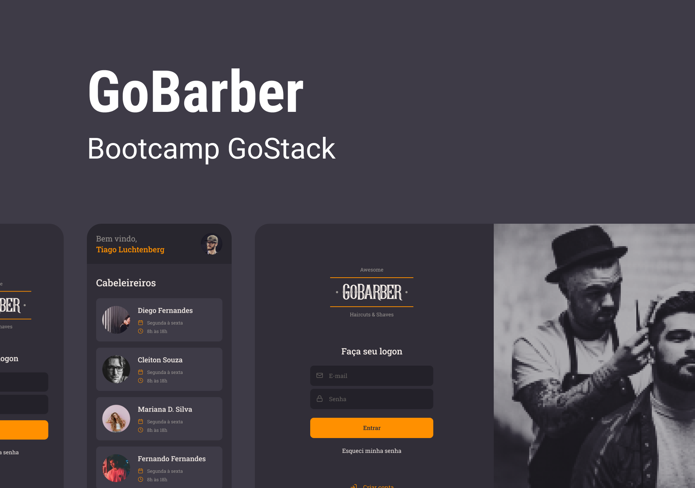

## Uma plataforma de agendamento de cliente e barbeiros

### Descrição

O Projeto foi criado durante o Bootcamp GoStack 13 promovido pela Rockeseat. Nele é possivel fazer seu cadastro, seja como usuário ou cabeleireiro, pela plataforma web e mobile. Também é possivel fazer agendamento com os cabeleireiros verificando os horários disponíveis.

### Como utilizar

- Para o projeto mobile basta executar os seguintes comandos:
  
  - yarn
  - yarn start + yarn android|ios

- Para o projeto web basta executar os seguintes comandos:

  - yarn
  - yarn start

- Para o projeto server basta executar os seguintes comandos:
  - yarn
  - yarn dev:server

### Tecnologias utilizadas

- Server: 
  - Node + express
  - Typescript
  - Postgres + typeorm

- Web: 
  - React
  - Typescript
  - styled components
  - Context API

- Mobile:
  - React Native
  - Typescript
  - styled components
  - Context API
